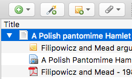
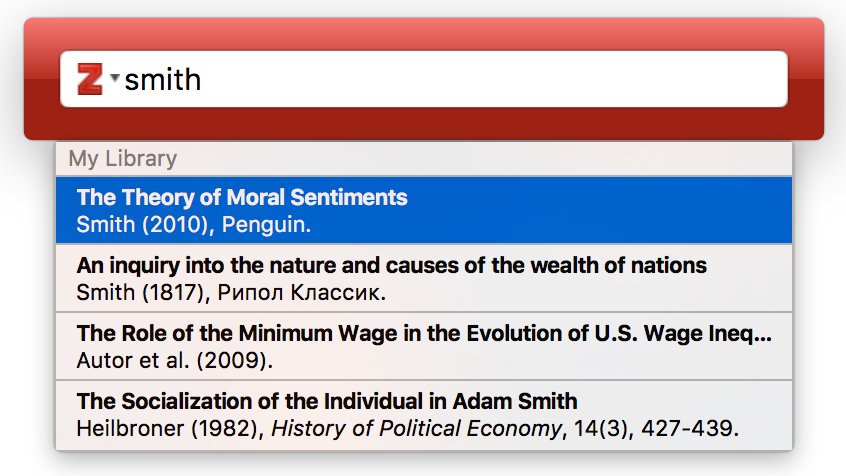
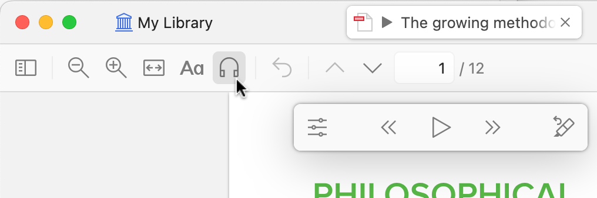

## Objectif de la séance

À la fin de l'atelier, vous devez pouvoir :

- **installer** un environnement Zotero fonctionnel
- **importer** et **corriger** une référence
- **organiser** et **partager** une petite bibliothèque
- **citer** dans un document et produire une bibliographie
- **transmettre** cette formation dans un format court

::: notes
Insister dès l'ouverture sur la logique de formation de formateurs.

Le verbe important à ajouter est `transmettre` : l'objectif n'est pas seulement de savoir utiliser Zotero, mais d'être capable de refaire une version plus courte de cette séance, par exemple en 2 heures, dans son institution ou son équipe.
:::

## Pourquoi un logiciel de gestion bibliographique ?

En recherche, et en particulier en thèse, un tel outil devient vite essentiel pour :

- **retrouver** vite ses sources
- **garder** une trace propre des lectures
- **citer** sans bricoler à la fin
- **rendre** la revue de littérature plus rigoureuse

::: notes
Cette diapo doit être générale, pas spécifique à CREONS.

L'idée est de partir des problèmes concrets de la recherche : accumulation de PDF, références dispersées, citations incohérentes, temps perdu au moment de la rédaction. C'est particulièrement parlant pour les doctorant·es.
:::

## Pourquoi Zotero ?

::: columns
::: {.column width="45%"}
Zotero est un bon choix parce qu'il est :

- **libre**, **gratuit**, **multiplateforme**
- **simple** à prendre en main
- bien intégré au **navigateur** et au **traitement de texte**
- adapté au **partage** et au **travail collectif**
- assez robuste pour la recherche, assez simple pour être transmis
:::

::: {.column width="55%"}
{width="28%" fig-alt="Logo Zotero"}

{width="100%" fig-alt="Vue générale de l'interface Zotero"}

<small>Source : documentation officielle Zotero.</small>
:::
:::

::: notes
Ne pas présenter Zotero comme le seul outil possible, mais comme le plus pertinent pour ce public.

Mettre en avant la combinaison décisive : gratuité, logiciel libre, simplicité d'usage, compatibilité multi-OS, connecteur navigateur, insertion dans les traitements de texte, groupes partagés.
:::

## Installer l'environnement de travail

Avant de commencer, il faut vérifier trois briques :

- Zotero Desktop
- le connecteur Zotero du navigateur
- Word ou LibreOffice pour tester l'insertion de citations

En plus, si possible :

- un compte Zotero pour la synchronisation et le partage

::: notes
Préciser que beaucoup de blocages viennent d'une installation incomplète.

Le minimum à tester en séance est : application ouverte, connecteur visible dans le navigateur, menu Zotero disponible dans Word ou LibreOffice. Mentionner le compte Zotero comme utile, sans en faire un prérequis absolu pour toute la séance.
:::

## Le cœur de l'atelier

Le noyau de la séance tient en sept verbes :

1. installer
2. importer
3. corriger
4. organiser
5. partager
6. citer
7. transmettre

::: notes
Cette diapo sert de carte de la séance.

Le dernier verbe, `transmettre`, doit être explicité : il annonce déjà la fin de l'atelier et la manière dont les participant·es pourront refaire cette formation auprès de collègues ou d'étudiant·es.
:::

## Importer

Sources à tester pendant l'atelier :

- DOI / ISBN
- page de revue ou portail documentaire
- PDF
- page web

::: notes
Montrer plusieurs portes d'entrée, mais rappeler que l'import automatique n'est qu'un point de départ.

Si le temps est limité, privilégier un DOI, une page de revue, un PDF et une page web. Ce sont les cas les plus utiles pour une formation courte réplicable.
:::

## Corriger

Une référence importée n'est pas une référence validée.

Points à vérifier :

- type de document
- auteur ou institution
- année
- titre
- revue ou éditeur
- DOI ou URL

::: notes
Probablement la diapo la plus importante pédagogiquement.

Faire passer l'idée que la valeur de Zotero ne vient pas de l'automatisation seule, mais de la combinaison entre import rapide et vérification humaine. Montrer un ou deux exemples de notices incorrectes.
:::

## Organiser

Bonnes pratiques minimales :

- utiliser des collections simples
- éviter de multiplier les tags
- repérer les doublons
- garder des règles communes dans le travail collectif

::: notes
Faire distinguer `collections`, `tags`, `notes` et `doublons`.

Conseil de transmission : quand ils refont la séance en 2h, il faut rester sur une structure simple et éviter les raffinements inutiles.
:::

## Partager

Les groupes Zotero sont utiles pour :

- construire une bibliographie commune
- faire circuler les références entre sites
- capitaliser et retransmettre plus facilement

::: notes
Relier cette diapo à la logique de coopération et de mutualisation.

Expliquer qu'un groupe Zotero n'est pas seulement un espace technique : c'est un support de travail collectif, de circulation des références et de capitalisation pédagogique.
:::

## Citer et produire une bibliographie

::: columns
::: {.column width="50%"}
À tester pendant l'atelier : 

- insérer une citation dans Word ou LibreOffice
- changer de style, générer une bibliographie
- dans Quarto / R Markdown : `.bib` + `@citekey`
- dans LaTeX : export BibTeX / BibLaTeX + `\cite{}`
- éviter les corrections manuelles trop tôt dans le document
:::

::: {.column width="50%"}
{width="100%" fig-alt="Boîte de dialogue d'insertion de citation Zotero"}

<small>Source : documentation officielle Zotero.</small>
:::
:::

::: notes
Cette diapo permet de fermer la boucle : on ne gère pas une bibliothèque pour elle-même, mais pour écrire, citer et partager.

Si possible, faire une démonstration très courte dans un document déjà préparé.

Mentionner ici qu'au-delà de Word et LibreOffice, Zotero s'insère très bien dans des workflows d'écriture scientifique plus techniques : Quarto, R Markdown et LaTeX. Pour Quarto/LaTeX, le bon réflexe est d'exporter une bibliothèque `.bib` propre depuis Zotero, idéalement de façon stable.
:::

## Exercice fil rouge

Par petit groupe :

1. importer 5 références
2. corriger les champs essentiels
3. ajouter un tag commun
4. rédiger une note courte
5. repérer les doublons
6. générer une bibliographie finale

::: notes
L'exercice doit rester faisable et vérifiable.

Insister sur la qualité plutôt que la quantité. L'objectif n'est pas de collecter beaucoup, mais de faire correctement les gestes clés que les participant·es pourront ensuite réenseigner.
:::

## Points de vigilance

- le connecteur navigateur peut échouer
- les PDF sont souvent mal reconnus
- les rapports sont souvent mal typés
- le suivi des modifications peut casser les codes de champs des citations
- mieux vaut 5 références propres que 20 références sales

::: notes
Cette diapo sert aussi à normaliser les difficultés : les problèmes techniques sont fréquents et ne signifient pas que l'outil est mauvais.

Prévoir un plan B simple : import manuel, DOI, ISBN, ou ajout direct d'une notice.

Ajouter un avertissement très concret sur le `Suivi des modifications` dans Word ou LibreOffice : si on modifie un appel de citation en mode révision, on peut supprimer sans le voir les codes de champs Zotero et désorganiser ensuite la bibliographie après `Refresh`.
:::

## Sortie attendue

À la fin de l'atelier, chaque participant·e repart avec :

- une installation fonctionnelle
- une mini-bibliothèque propre
- une citation et une bibliographie générées automatiquement
- un canevas réutilisable localement en **2h**

::: notes
Rappeler que la sortie attendue n'est pas seulement individuelle.

Chaque personne doit repartir avec quelque chose qu'elle peut réutiliser dans sa recherche et retransmettre à d'autres.
:::

## Refaire cette formation en 2h

Version courte à transmettre ensuite :

1. 15 min · pourquoi un outil bibliographique et pourquoi Zotero
2. 20 min · installation et vérifications
3. 25 min · importer et corriger
4. 25 min · organiser et partager
5. 20 min · citer dans un document
6. 15 min · partage, questions, ressources

::: notes
Cette diapo est indispensable pour la logique de formation de formateurs.

Montrer qu'il est possible de refaire une version courte, réaliste et robuste. L'idée est de donner un canevas simple, pas un programme maximaliste.
:::

## Ressources complémentaires

Après la séance, on pourra produire :

- une fiche exercice
- une fiche mémo de bonnes pratiques
- une version courte réutilisable localement

::: notes
Conclure sur les livrables et la suite du travail.

Cette diapo peut aussi servir à annoncer ce qui sera partagé après l'atelier.
:::

## Index des annexes

- stockage Zotero avec une adresse IRD
- tour d'horizon des applications mobiles
- veille récente : Retraction Watch, Zotero 7 à 9
- extension du stockage via WebDAV
- zoom sur Zotero 9
- extensions et astuces utiles
- retours pédagogiques et usages avancés

::: notes
Cette diapo permet de signaler clairement que la suite est optionnelle.

Elle est utile si tu veux garder un cœur de séance resserré et réserver les questions plus techniques ou prospectives à la fin.
:::

## Annexe · Stockage Zotero avec une adresse IRD

À mentionner aux participant·es concerné·es :

- adresse IRD = stockage illimité sur Zotero
- si le compte utilise déjà l'adresse IRD, l'avantage s'applique automatiquement
- sinon, ajouter l'adresse IRD comme adresse secondaire dans le profil

Rappel utile : sans cela, le stockage gratuit des fichiers joints est limité à 300 Mo.

::: notes
Présenter cette information comme un bonus pratique en annexe.

Elle est utile pour les collègues IRD, mais ne doit pas alourdir le cœur de la séance. Bien distinguer le stockage des métadonnées et celui des fichiers PDF.
:::

## Annexe · Alternative WebDAV pour les fichiers joints

Il est aussi possible d'étendre le stockage des fichiers joints avec un serveur WebDAV, par exemple un service institutionnel.

- piste à explorer :

- IRD Drive de l'UMI SOURCE, si cette solution est disponible et pertinente localement
- ressource de référence : https://zotero.hypotheses.org/4791

::: notes
Mentionner cette piste comme option avancée, pas comme prérequis.

Elle peut intéresser les personnes qui gèrent beaucoup de PDF ou qui souhaitent un stockage institutionnel. Ne pas ouvrir ce point trop tôt dans la formation principale.
:::

## Annexe · Tour d'horizon des applications mobiles {.smaller}

Zotero existe aussi sur mobile :

- **iOS** : synchro, lecture/annotation PDF, capture depuis Safari, scan DOI/code-barres
- **Android** : synchro, annotation PDF, ajout par identifiants, récupération de métadonnées PDF, scan ISBN

À retenir :

- utile pour lire, annoter et capturer des références en mobilité
- pratique pour reprendre ensuite son travail sur ordinateur
- bon argument pour montrer que Zotero accompagne tout le cycle documentaire
- sur Android, un réglage permet aussi d'utiliser un stockage WebDAV compatible
- le scan d'ISBN ouvre des usages intéressants pour rétro-cataloguer rapidement une petite bibliothèque papier

::: notes
Rester concret : le mobile n'est pas le cœur de la formation, mais c'est un bon levier d'adoption.

Sur iOS, tu peux mentionner la génération de bibliographies et la capture via le bouton Partager. Sur Android, l'ajout par identifiants, la récupération de métadonnées PDF, le WebDAV et le scan d'ISBN sont particulièrement parlants.
:::

## Annexe · Fonctionnalités avancées et veille Zotero

Quelques évolutions intéressantes à signaler :

- **articles rétractés** : Zotero peut signaler des publications rétractées grâce à l'intégration avec **Retraction Watch** et avertit aussi au moment de citer
- **Zotero 7** : interface revue, lecteur enrichi, EPUB et snapshots annotables
- **Zotero 8** : citation améliorée, annotations visibles, renommage continu des fichiers
- **Zotero 9** : lecture audio, *Recently Read*, annotations insérées dans les traitements de texte

Pourquoi c'est intéressant pédagogiquement :

- Zotero évolue vite
- certaines fonctions renforcent la lecture critique et la traçabilité
- d'autres améliorent directement la rédaction et le travail collectif

::: notes
Cette diapo sert de veille légère, pas de catalogue complet.

Pour les articles rétractés, préciser que Zotero s'appuie sur Retraction Watch, signale les items concernés dans la bibliothèque et avertit aussi au moment de citer. Pour les nouveautés, choisir 2 ou 3 exemples maximum à commenter oralement selon le temps.
:::

## Annexe · Zoom sur Zotero 9

::: columns
::: {.column width="48%"}
Points saillants de la version 9 :

- **Lecture à haute voix** sur PDF, EPUB et captures web
- **Lectures récentes** pour retrouver vite un document lu
- **Ajouter une annotation** directement dans Word ou LibreOffice
- **Ajouté par** / **Modifié par** dans les bibliothèques de groupe
- **renommage par groupe** pour harmoniser les pratiques collectives
- **connexion via le Web** plus sûre et plus simple

À noter :

- la lecture à haute voix de haute qualité demande une connexion internet et un compte Zotero
- les voix de meilleure qualité sont liées aux offres de stockage Zotero
- la lecture à haute voix doit aussi arriver sur iOS et Android
:::

::: {.column width="52%"}
{width="100%" fig-alt="Fonction Read Aloud de Zotero 9"}

<small>Source : blog officiel Zotero, Zotero 9.</small>
:::
:::

::: notes
Cette diapo peut servir de conclusion prospective.

Les éléments les plus intéressants pour ce public sont probablement : la lecture à haute voix, l'insertion directe d'annotations dans les traitements de texte, les colonnes `Ajouté par` / `Modifié par` dans les bibliothèques de groupe, et la connexion web plus sûre. Cela montre que Zotero évolue non seulement comme gestionnaire bibliographique, mais comme environnement complet de lecture, annotation, rédaction et collaboration.
:::

## Annexe · Extensions et astuces utiles

Quelques pistes utiles à connaître :

- **Add-on Market for Zotero** : facilite la découverte et l'installation d'extensions compatibles avec Zotero 7+
- **Zoplicate** : améliore le dédoublonnage, y compris par lot, et permet de marquer de faux doublons
- **Zotmoov** : aide à copier, déplacer et organiser les fichiers joints dans des répertoires externes
- **BetterBibTeX** : très utile pour des exports BibTeX stables, personnalisés et plus propres

Astuce rapides :

- `dépersonnaliser` un export BibTeX avec BetterBibTeX
- utiliser des **émoticônes dans les marqueurs**
- surveiller certaines références **PsycInfo** qui peuvent bloquer la synchronisation

::: notes
À présenter comme une boîte à outils optionnelle.

Le bon message pour la formation principale est : commencer simple avec Zotero seul. Les extensions deviennent utiles quand un besoin concret apparaît : gros dédoublonnage, export BibTeX avancé, gestion fine des pièces jointes, etc.
:::

## Annexe · Retours pédagogiques et usages avancés

Deux pistes intéressantes pour prolonger la formation :

- **Markdown et prise de notes** : des outils comme MarkDB-Connect, souvent en lien avec BetterBibTeX, permettent de lier des notes Markdown externes à une bibliothèque Zotero
- **groupes Zotero en pédagogie** : des retours d'expérience montrent qu'une bibliothèque de groupe avec une collection par sous-groupe fonctionne bien pour un travail collaboratif international

Leçons utiles pour une formation de formateurs :

- distinguer l'apprentissage de l'outil et le travail académique demandé
- faire créer les comptes Zotero avant la séance
- anticiper l'entrée dans les groupes Zotero
- garder une organisation simple : une bibliothèque de groupe, puis des collections par équipe ou thème

::: notes
Cette diapo est particulièrement utile pour ton contexte de formation de formateurs.

Tu peux t'appuyer sur ces retours pour justifier des choix pédagogiques très concrets : faire créer les comptes avant, éviter de tout faire apprendre en même temps, et utiliser les groupes Zotero comme support d'apprentissage collectif plutôt que comme simple espace de dépôt.
:::
